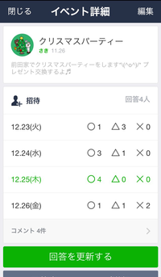

趣味のテニスの話  
テニスサークルに参加したいと思い、ご縁をいただいて顔を出す中で、テニスサークルのスケジュール管理と参加者調整をもっとスマートにできないだろうかと思いはじめた。

小さめのサークルだと、だいたい LINEグループで連絡を取っている。 トーク内に一ヶ月分のスケジュールと参加予定者をテキストで書いて、アップデートがあればその都度送るのだけど、どう見ても効率が悪そうだ。

テニススクールのイベント案内も、LINE トークにテキストで飛んでくる。こちらは Webサイトの予約フォームへのリンクなのでまだ楽だけど、Webサイトがスマホ対応してなかったり、不便が多い。  
もっと手軽に予約したい。

サークルのスケジュール管理サービスなんてすでにたくさんありそうだと思って探してみたら、だいたいどれもグループウェア的な性格で、そのサービス内にコミュニケーションを囲い込もうと意図しているようだった。サイボウズ的な。（サイボウズLiveは 2019年4月でサービス終了だった）

[クラブ活動.com - スケジュール管理 出欠管理 掲示板 無料 グループウェア](https://clubkatsudo.com/)

[サークルスクエア - スケジュール共有･出欠管理に | 無料グループウェア - 携帯,スマホ(スマートフォン),アプリ対応](https://www.c-sqr.net/)

[Team Manage チームマネージ](https://www.team-manage.com/)

どれも求めてるものとちょっと違う。  
プラットフォームは LINE でいい。もはやインフラなので  
新規メンバー入るたびに「このサービスにアクセスして登録してね！」みたいなのは面倒くさすぎる。

LINEスケジュールはあるけど、これは単発イベント向けなので継続的なスケジュール管理は想定していない。

[LINEスケジュール](https://schedule.line.me/)

趣味は生活の延長なので、使うサービスは透明性を高めたい。  
その点で LINE は頭ひとつ抜けている。

LINE、エンジニア大量採用かけているし [【イベント開催レポート】LINEはエンジニア3000名規模へ！LINEエンジニア採用の日 : LINE Engineering Blog](https://engineering.linecorp.com/ja/blog/detail/330)

福岡市との連携もはじまったし [LINEとLINE Fukuoka、福岡市と地域共働事業に関する包括連携協定を締結　AIやFintechなどの技術を組み合わせた取り組みを推進 | Social Game Info](https://gamebiz.jp/?p=218627)

生活のデジタルインフラとして浸透していくと面白そう。

とはいえ、趣味領域のデジタルサービスは大きくマネタイズする領域ではなさそうなので  
当分はユーザー側でうまいことやってね、になるだろうな  
（だからこそ LINE くらい大きい会社にやってほしいのだけど）  
今年はキャッシュレスの覇権争いで各社忙しそうだし

サービス作る余地ありそう。  
LINE Developers を眺めながら、なにかうまいことできんかなと思案中。  
[LINE Developers](https://developers.line.me/ja/)
