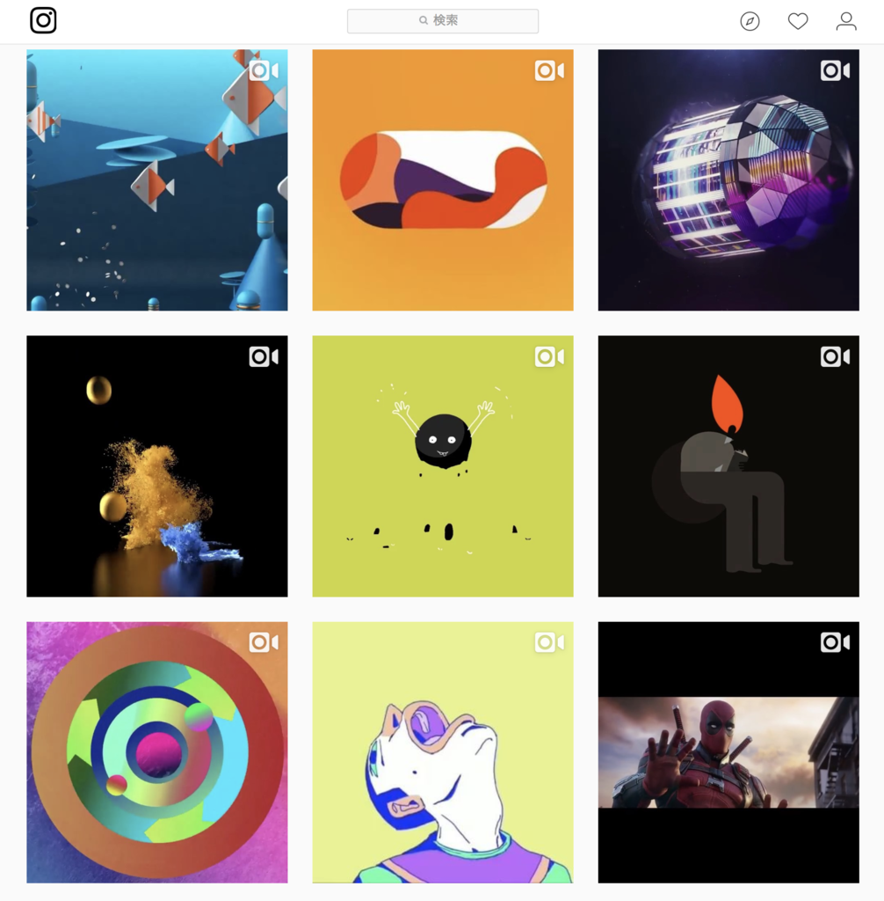

Motion Graphics とか VJ なんかの映像表現が好きで、見ていて飽きないのだけど、 インスタグラムで MotionGraphics のおすすめアカウントを見つけて、センス良い表現を次々拾えるようになって素敵だった。

一昔前のインターネットにあった玉石混交なカオスさはすっかり鳴りを潜め、レコメンドエンジンは機械学習の成果を高め続けている。まあ良い時代やなとつらつら眺めながら、ふと怖くなった。

こんなふうに、自分で探さず流れてくるものをただ吸収していたら、自分の好みやスタイルはどうなっていくんだろう？初期値は？子供の頃の環境？

4歳の息子は毎日 Netflix や Amazon Prime Video で好きなアニメを見て楽しんでいる。 （YouTube はおもちゃレビュー動画ばかりなので禁止してる）

子供の頃最初に触れるメディアが YouTube や Netflix みたいな、「洗練された」ものだけになって、最初にアカウントつくって見る動画がそれらメディアのおすすめによるとしたら、それは大多数の好みによって誘導される大多数の意見なのではないか？

どこまでいっても「○○」が好きなあなたには「XX」をオススメされる世界。

個人の趣味嗜好やスタイルが育つ前に、大多数の取捨選択結果とAIによる解釈が同質化を進めるのでは？きちんと個々人の好みが細分化していって、現代のような（ある意味分断されがちな）コミュニティへ分かたれていけるのだろうか？

と、ここまで考えて杞憂だなと思った。そんなの今に始まった話ではなかった。

人間の気質は遺伝的要素で7割決まっているという研究もあるし

初期値はあらかじめ決まっていて、あくまでも取捨選択と AI によるパターン分析と解釈があるだけなら、人間の（特に子供の）好奇心がそんな枠で収まりきることもない。つまるところ「好きなもの」を追求していくだけで、そのうち AI のレコメンドなんかには「飽き」て、より新しいもの、画期的なもの、共感できるものへと移っていくんだろう クリエイティビティが AI を使いこなす世界。ジャービス。

アイアンマンはジャービスとスーツ作ってるシーンがなにげに一番ワクワクする。

[『アイアンマン』J.A.R.V.I.S.をリアルに作る！FacebookCEOの今年の目標が壮大 - シネマトゥデイ](https://www.cinematoday.jp/news/N0079305)
