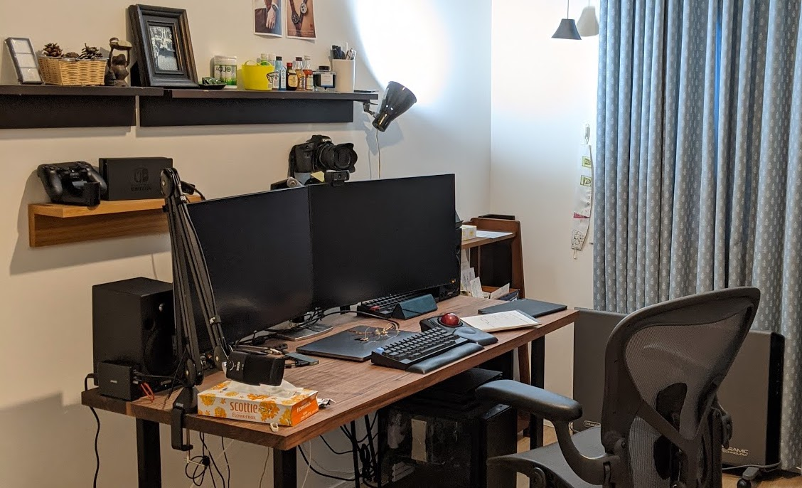

あと 45分しかない、、、！エクストリーム2020年振り返りをやります。

### なんてったってコロナ

年のはじめには武漢がなんか大変そうだねーなんて笑っていたら、あれよあれよとSFが現実になっていった。  
福岡は東京などに比べるとそれでもどこかのんびりしてて、マスク警察だなんだとピリピリしてることはなかったけど 仕事はフルリモートに切り替わり、学校は休校、家族で家にいて、夏は大型のビニールプールがやたら売り切れていた。

紅白聞きながらこれを書いてるけど、「しんどい時期ほど陽気な曲が増えるよね」という家族の言葉が響く。 なんか慣れてしまったけど、歴史的な一年だったのよね。

### 仕事

そんな中転職した。もともと副業で手伝っていた Ubie 株式会社にソフトウェアエンジニアとして入社し、Kotlin や Rails も書くようになった。  
といってもまだ本格的にバックエンドを構築したりしてるわけではなく、フロントエンド開発が主ではあったので、来年はもっと深いところまでハマりにいきたい。  
まわりのエンジニアが優秀すぎて幸せ。本当に優秀な人が身近にいて日常的に話ができるというのは何よりも福利厚生だし、自分にとっては成長源。

Ubie では開発以外の、情報の透明性維持やエンジニア採用などのマネジメント風味な仕事も積極的に拾っていってるので開発一辺倒というわけにはいかないが、できる限りどちらも成果を出す。

Ubie のミッションやカルチャーはすごく気に入っていて、かつ組織文化が性に合っているので、本当に運が良かったと思う。  
組織が大きくなるにつれ変わっていくものもあるだろうけど、本質を見失わずにやりきっていきたい。

ありがたいことに、副業で某社のフロントエンド開発サポートやアドバイザーとしても関わらせてもらうようになった。

### 断捨離とWFH環境改善

家にいる時間が増えて、散らかっていることによるストレスが増えたので徹底的に片付けた。  
使ってない雑貨、着ない服、かさばる家具を捨てるか売るかしているうちにミニマリズムに目覚めたが、Netflix の「ミニマリズム」やこんまりの思想はちょっとやりすぎ感あって馴染まず、ほどほどに落ち着くことにした。  
テレビも捨てて、思い切ってプロジェクターを導入したらQOLがすごいことになった。

自宅の仕事環境も見直した。 転職してしばらくはコワーキングスペースで仕事するつもりでいたが、天神への移動が面倒になってきたのと感染リスクやらもろもろ踏まえて、自宅の環境整備の方に投資することにしてあれこれ買い揃えた。

*   デスク（ウォールナット天板 + かなでものの脚）
*   アーロンチェア
*   マイク & マイクアーム（RODE NT-USB）
*   モニタースピーカー
*   デスクトップPC（Linux Desktop として組んだけど今はほぼゲーム用）

ほか、ボリュームコントローラーなどあれこれ小物も導入して快適になった。

仕事部屋の机

### テニス上達した

緊急事態宣言が解除されることからテニス再開できたので、シングルス草トー優勝の目標を立てて練習した。  
目標を設定したことで、勝つために必要な技術・戦術や自分に合った道具などを真剣に考えて練習するようになったのでとても良かった。  
結果、一番下のクラスだけど優勝できたし、継続的にラケットやストリングの組み合わせを模索し続けて、ようやく自分に合ったラケット、ストリングに出会うことができた。

ラケットは買い替えたりレンタルしたり、試し打ちさせてもらったりで計10機種くらい打った。  
ラジカルは球威が出ず、重さやフェイス面積、パワーレベルなどをどうするか悩んでピュアアエロに替えたりしてみたが、飛びすぎが怖くてフォーム崩れたので合わず。  
結局プレステージプロに落ち着く。重さで球威を出し、コントロールしつつ振り切って収めるスタイル。

模索してる途中で、ラケットとストリングの種類、組み合わせ、プレイスタイルとの相性などを調べるのに困ったので、エンジニアリングでどうにかしたい気持ちが高まってる。  
個人サービス作り始めているが、未だ完成せず。2021年にはリリースしたい。

### ウェブ縄文時代への憧れ

ここまでつらつら書いておいてなんだけど、ブログプラットフォームを離れて自前ブログに戻りたいと思い始めた。 古き良きかつてのウェブ、ではないけれど、運営の意向ひとつで方針が変わるプラットフォームから離れて自分のやりたいようにやるのはしっくりくるものがある。  
正月休みの間にやってしまおうか。

### まとめ

（記事公開が0時ちょうどになってしまった）  
2021年も、仕事とテニスと個人開発やっていきます。
